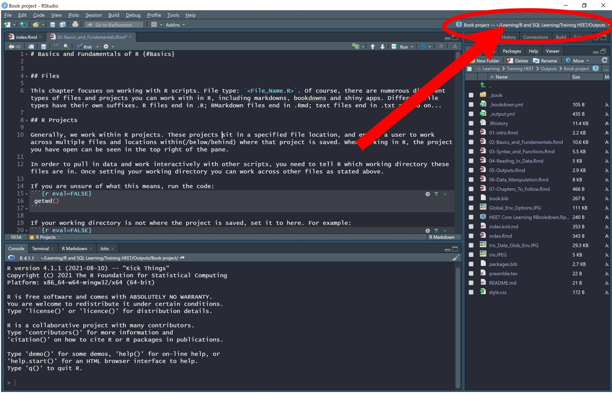
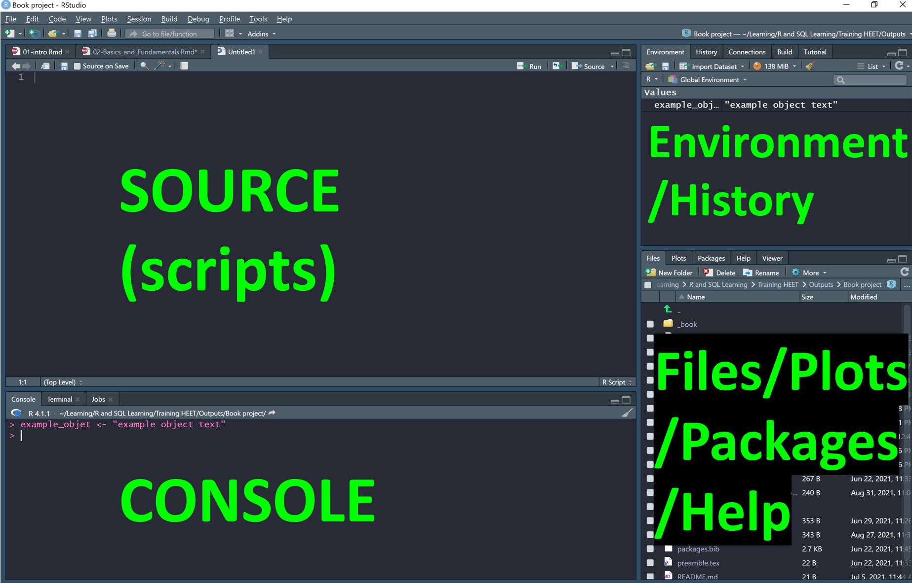
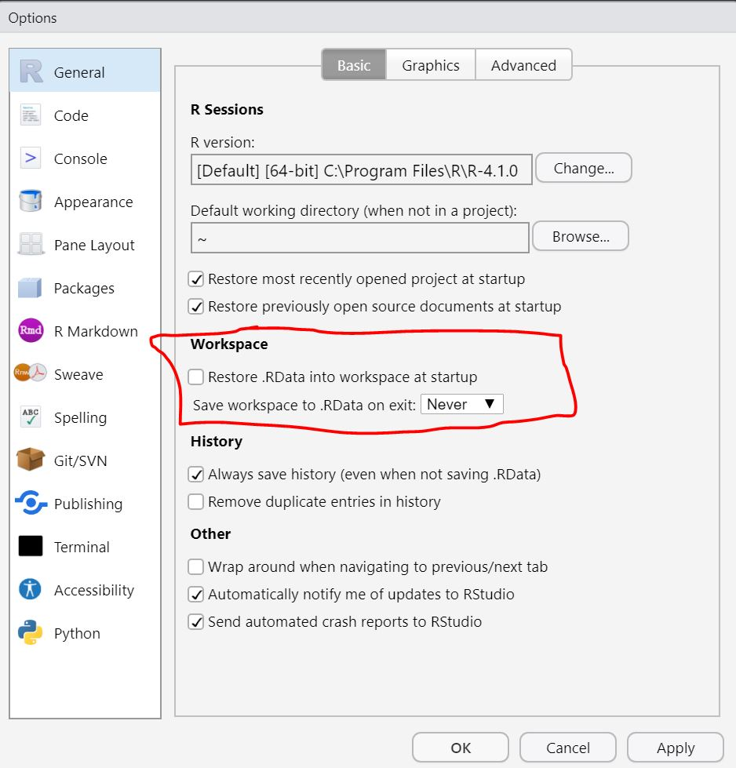
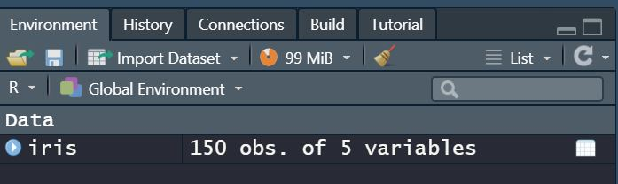

# Basics of R {#Basics}

```{r, echo = F}
library(knitr)
opts_chunk$set(tidy.opts=list(width.cutoff=80),tidy=TRUE)

```

To make sure you have the most up-to-date version of R, run this code:

``` {r,  eval=FALSE}
 if(!require(installr)) {
     install.packages("installr"); require(installr)} #load / install+load installr
 
# using the package:
 updateR()
 
```

## R and R studio

R is a programming language just like Python and javascript. Many of it's applications are used for statistics, modelling and working with data. 

R studio is an integrated development environment (IDE) where you can use the R programming language (as well as Python). It supports writing in the language, executing code, file management, version control etc. It is a good way to code in R. You can use other programmes to code with R, such as Visual Studio (though you might need an extension). I recommend using R studio and this book will all guide through the use of R in this IDE. 


## Files

This chapter focuses on working with R scripts. File type: `<File_Name.R>`. There are numerous different types of files and projects you can work with in R, including markdowns, bookdowns, presentations and shiny apps. Different file types have their own suffixes. R files end in .R; RMarkdown files end in .Rmd; text files end in .txt etc.

As with any work, how you save and document your work is a choice. Depending on the objective, different approaches might be taken. For basic data analysis you have two main options, both of which are valid. You can just open an R script, save it in a file location and work from there. You will need to tell the R script where it is saved by setting your working directory. This is fine for ad hoc bits of work, but for bigger things, you should use R projects

## R Projects {#Projects}

Projects act as a way to group your scripts and therefore separate out your work strands. When you open a project, the files pane will automatically open up as where the project is saved. This then allows you to see all of your files. To create a project, click file + new project. To create a script within this project, click file + new file + R script.

Projects also enable version control through git and devops. In order to learn about these, see the [stats production guidance on git](https://rsconnect/rsc/stats-production-guidance/git.html), [the ESFA guidance on git](https://rsconnect/rsc/esfa-r-training/git-building-intuition.html) and  [the analytics academy videos on git](https://trello.com/c/rKA6xl3Y/300-git-part-1-git-it-on). More on this later.

Projects sit in a specified file location, and enable a user to work with multiple files within (/below/behind) where that project is saved. When working in R, the project you have open can be seen in the top right of the pane.


```{r, echo=FALSE, out.width='80%', fig.align='center'}

```

In order to pull in data and work interactively with other scripts, you need to tell R which working directory these files are in, so it knows where to look. Once setting your working directory you can work across other files as stated above. 

If you are unsure of what this means, run (in either the console or a script) this code:

```{r eval=FALSE}
 getwd() #this code will tell you the file path you are currently working in
```


If your working directory is not where the project is saved, setting it to that path is usually a logical way to start. For example:
```{r eval=FALSE}
  setwd("//vmt1pr-dhfs01/Working/HE-EAT-WKG-FS") 
```

You can tab across after the forward slashes to find a file location or, alternatively, paste a file location from your file explorer. Important to note is that R reads forward slashes and backslashes differently to the file explorer. A file path in R generally requires forward slashes (or double backslashes). To normalize a file path that you've copied directly from an explorer window, you can use the function `normalizePath()` or `readClipboard()` with the copied file path.

There are two ways to define paths to a file or directory:

* **Relative paths** which find a location from an existing location, rather than the root of the file system. Relative paths cannot, therefore, span different drives. 
* **Absolute paths** which are defined by including an entire path from the root directory

Having set your file location, you can then navigate and source files from anywhere within that file location. 

Relative paths can be coded using `/`, `~` and `..`. For more information see [this web page](https://ytakemon.github.io/2019-10-22-R-BCCRC/02-filedir/)

The most common usage of relative pathing will be using `..` to navigate upwards and `/` to navigate downwards. Say your working directory is: `//vmt1pr-dhfs01/Working/HE-EAT-WKG-FS/Graduate Outcomes`, but you wanted to access a file in the `Working` folder, 2 sub-folders above the Graduate Outcomes folder, you could navigate here with 2x `..`s:
```{r eval=FALSE}
source("../../example_folder_name")
```
Another way to do this would be to set your working directory to that folder, access the file, then reassign the working directory to where it was before.

## R Studio's Panes

The R Studio window splits up into four quadrants, which can be dragged and adjusted depending on what you wish to focus on. Each pane has different functions, the basics of which are covered below.

```{r, echo=FALSE, out.width='80%', fig.align='center'}

```

**Left hand side:** 

Where you run and store code. Code can be run by highlighting the code in a script (top left) and pressing ctrl + enter, _OR_ by writing it in the console (bottom left) and pressing enter. The 'Run' button at the top right of the source pane will also execute code.

*Usage:* code that you want a record of and might want to re-run at any time should be written and run in scripts (the source). Code that you do not need to save can be written in the console. Things like `getwd()` or data exploration functions are, therefore, usually written in the console. If you want to install a package, do a quick calculation or look up a function's documentation, you could put these in the console. Most things are probably better for writing in scripts, though.

**Right hand side**
 
Your files will show up in the files pane in the bottom right. Also this for viewing plots (all plots are stored behind each other in the plots tab, if you want to navigate between old and new plots you’ve produced). 
 
The help bar is also contained in the bottom right pane. If you are ever unsure about the documentation or application of a function, package or command you can run:
```{r eval=FALSE}
 ?function_name()
```
the helper will then appear. 

The environment (top right) is where all the objects, values and functions you create will sit. Also, if you’ve connected to a server, this connection will appear in the connections tab. Your history is stored in the history tab.

You want to clear the environment semi-regularly, so that you are not interacting with or using objects that do not exist if you re-run your code. They might have been removed or created in a way that does not create the proper object if you were to re-run your code from start to end. **Set your global options to never save ,RData on exit.** Do this by clicking tools + global options + general.


```{r, echo=FALSE, out.width='80%', fig.align='center'}

```


To see all the items in the environment use
```{r eval=FALSE}
 ls()
```


To remove an item use 
```{r eval=FALSE}
# remove 2 objects
 rm(object_name1, object_name2)

# remove all objects except df1_to_keep and df2_to_keep
rm(list=setdiff(ls(), c("df1_to_keep", "df2_to_keep")))

```

## Packages

R uses packages and functions to enable you to work efficiently. 
BaseR is pre-installed. It contains basic functions to assign objects, create 'if' statements, add two numbers together, create lists etc. Additionally, because R is an open source programme, developers have built other packages that you can install and load into R. These packages contains functions and functionality which can make coding easier and more efficient.

Any uninstalled package needs to be installed first: 
```{r eval=FALSE}
 install.packages(“package_name”)
```
Once a package is installed, its functionality can be used by loading it into your project
```{r eval=FALSE}
 library(installed_package_name)
```


To load my packages at the start of a project, I link to a script with this code in. The `pacman::p_load` function loads packages if they're installed already, installs them then loads them if not. The set of packages are the core ones I use in lots of work I do. You might want to add or take others out.
```{r, eval = FALSE}
 if (!require("pacman")) install.packages("pacman") #this will load the pacman package
 pacman::p_load(dplyr,                    #the :: specifies to use the p_load function from the pacman package. Some functions are named identically in more than one package; this ensures you use the correct one. 
                data.table,
                stringr,
                stringi,
                tidyverse,
                stats,
                openxlsx) #add any packages to this list
```

If any packages cannot be installed, you might be using an outdated version of R. To update it:
```{r, eval=FALSE, tidy=TRUE, tidy.opts=list(width.cutoff=80)} 
# Run this to install "updateR"
 if(!require(installr)) {
         install.packages("installr"); require(installr)} #load / install+load installr
 
 # use the package to update your R:
 updateR()
```

## Data types

R has various data formats and types. Working with R, it is important to appreciate that there are nuances between data types. They are useful for different things, and get called in different ways. 
 
R has 6 basic data types. 
 
*	**character:**    "a", "swc"
*	**numeric:**    2, 15.5
*	**integer:**    2L (the L tells R to store this as an integer)
*	**logical:**    TRUE, FALSE
*	**complex:**    1+4i (complex numbers with real and imaginary parts)
*	**raw**

Sometimes you will need to transform the data type. For example, if numbers are stored as characters. This will prohibit mathematical functionality. To convert between data types, use `as.numeric`, `as.logical` and others as functions or as arguments within other functions. The most basic example to change a column's data type `mutate(example_column = as.numeric(example_column))`.

Be careful when converting text to numbers, `as.numeric` will return "NA" if you try to convert "6,377" to 6377, because of the comma.  To get around this, consider string manipulation functions from the `stringi` or `stringr` packages, or `readr::parse_number`. 

For more examples of changing data structures see the [data manipulation chapter](#mutating) or the (more advanced) [user-defined functions chapter.](#Changing_Data_Type)

## Data structures

R has many data structures. These include:

*	data frame
*	vectors (atomic vectors are vectors with one type of data)
*	factors
*	matrix
*	list

R is generally used to work with data and objects, especially in the most rudimentary uses (which is what we are covering in this chapter). In order to do this, you usually load external data - e.g., from excel files or SQL servers - though you could also encode objects and data yourself from scratch. The sections below show how to load and explore objects in R.

### Data Frames

A data frame is an array of rectangular data (which makes it easy to manipulate). Any table you load in correctly from excel will be stored as a data frame.
 
For the purposes of exploration below, we will load in the iris dataset. This is pre-loaded to R. 
 
We can explore the data using functions in BaseR
```{r eval=FALSE} 
 data("iris")           # it is a data frame with 5 variables (columns) and 150 observations (rows)
# to load the data, just type iris into the console and hit enter
```

```{r, echo=FALSE, out.width='80%', fig.align='center'}

```


```{r, eval=FALSE, tidy=TRUE}
# what tyoe of object is iris?
 class(iris)            # tells us it is a data frame
[1] "data.frame"

# How many rows does the data frame have?
 nrow(iris)             
[1] 150
 
 # How many elements are in the data frame?
 length(iris)           
[1] 5
 
 # what are the column names?
 names(iris)            
[1] "Sepal.Length" "Sepal.Width"  "Petal.Length" "Petal.Width"  "Species" 
 
 # What are the unique variables in the species column? 
 unique(iris$Species)   

 # These are stored as a factor with 3 levels
[1] setosa     versicolor virginica 
Levels: setosa versicolor virginica
 
 # What is the structure of the data. What are the variable types? 
 str(iris)             

[1] 'data.frame':	150 obs. of  5 variables:
 $ Sepal.Length: num  5.1 4.9 4.7 4.6 5 5.4 4.6 5 4.4 4.9 ...
.............
$ Species     : Factor w/ 3 levels "setosa","versicolor",..: 1 1 1 1 1 1 1 1 1 1 ...
 
# Open the data frame in a pane. You can hover over the column index, column title and see the data structure and range
 View(iris) 
 
# see if you have any duplicates in the data 
 duplicates_df <- iris %>%
   group_by(Sepal.Width) %>%
   filter(n() > 1)
```

### Vectors

A vector is a sequence of data elements. Vectors will contains elements of the same type or will convert the elements implicitly. In a vector, the order matters. If you think mathematically, R reads a vector in order. This is one way a vector is distinguished from a list
 
We can use the assign syntax `<- c()` to assign vectors 

```{r, eval=FALSE, tidy=TRUE, tidy.opts=list(width.cutoff=80)} 
x <- c(1, 2, 3) #R will create an vector, x, with 3 numeric elements
x1 <- c(1, 2, 3, "4") #R will read all elements as characters because we specified that 4 is a character
y <- c(10, 100, 1000)

z <- x * y # vectors can be multiplied 
```

vectors can also be character strings
```{r eval=FALSE} 
GO_Team <- c("Gabe", "Hindowa", "Tom")
GO_Team[3] #this it the element in position 3
[1] "Tom"
```

You can add and remove elements from vectors
```{r eval=FALSE} 
# create a vector of the numbers 1,2,3,4
n4 <- c(1:4)
# add the number 5 to the vector
n5 <- append(n4, 5)


# removing objects from a vector
# define a %notin% function
`%notin%` <- Negate(`%in%`)
# remove 4 and 5 from the n5 vector and assign it to n3
n3 <- n5[n5 %notin% c(4,5)]
```


### Factors

A factor is essentially a vector of n integer values with a corresponding set of character values. The only input argument you need to specify is a vector of values from any atomic (same data) type, and the factor function will return a vector of factor values. This relates to the concept of levels, where the level of a factor is basically the number of distinct elements, in reverse order to how they are written. You can specify the levels if you wish to change the order. 

```{r, eval=FALSE, tidy=TRUE, tidy.opts=list(width.cutoff=80)} 
Employee_Of_The_Week <- factor(c("Tom", "Tom", "Tom", "Tom", "Hindowa"), ) #creates a factor in the global environment. You can specify the order of the levels. If not specified, R will do this automatically (in reverse to the order they appear)
print(Employee_Of_The_Week)

#       [1] Tom     Tom     Tom     Tom     Hindowa
#       Levels: Hindowa Tom

# You could specify the levels with a levels = argument. E.g. levels = c("Hindowa", "Tom")

levels(Employee_Of_The_Week) # the levels are the order in which the elements appear
Employee_Of_The_Week[5] #this returns the element in position 5 of the factor
```

Factor levels are important when you need to specify the order of something e.g. to arrange graphs by High , Medium, Low, Specialist, this uses a tariff vector `x <- c("High", "Medium", "Low", "Specialist")` as the levels for turning the tariff column into a factor. 

### Matrices 

Matrices are used in regression analysis and other more complex data exercises, but not much in the standard outputs we produce. A matrix is a collection of elements of the same data type (numeric, character, or logical) arranged into a fixed number of rows and columns. 
```{r, eval=FALSE, tidy=TRUE, tidy.opts=list(width.cutoff=80)} 
Matrix1 <- matrix(1:8, 2, 4) # this creates a matrix of the numbers 1 to 8, in 2 rows and 4 columns. It fills down from column 1 and then column 2, such that the number 3 is the in position [1,2]
```

### Lists

Lists hold different types of data i.e. character, numeric and integers and data frames in a single list. You can access the elements of this list with square brackets `[]` or the dollar sign `$`

```{r, eval=FALSE, tidy=TRUE, tidy.opts=list(width.cutoff=80)} 
list_example <- list(1, 2L, "3") # here 1 is stored as a number, 2 an integer and 3 a character.
```
You can also house multiple objects within a single name in the global environment, which could make accessing analysis tidier.

```{r, eval=FALSE, tidy=TRUE, tidy.opts=list(width.cutoff=80)}
# create an element, Int_SNs, which houses 2 sheets of data: England_SNs and Scotland_SNs
Int_SNs <- list(England_SNs = readxl::read_xlsx("SNs.xlsx", sheet = "England"),
                      Scotland_SNs = readxl::read_xlsx("SNs.xlsx", sheet = "Scotland"))

# extract the england df from the list of international dfs
England_SNs <- as.data.frame(Int_SNs[England_SNs])
```