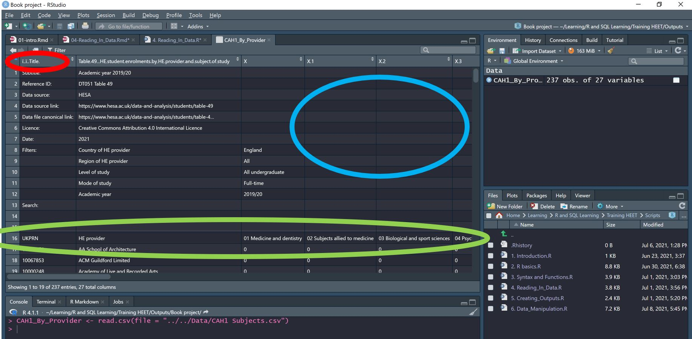

# Reading in Data 

We use R to Manipulate and analyse data. However, R doesn't have a store of data (aside from some basic pre-loaded datasets), we need to save this outside the R environment and then load or read it into R. Our data tends to be stored in excel files - either workbooks or .csvs - or SQL databases. You can also read in data  from Stata and other programmes. Use Google to find packages which allow you to read in this data if this is how your data is stored. In this section we will focus on 3x HE-focused examples of reading in data. The data files are saved in the HEEAT technical resources folder. If you set your working directory as per the code below, you will be able to read in the data files being used. 

## Good practice

As shown below, **documentation is essential**. For example, if you download data from HESA and delete the 14-18 rows of table identifiers, a future analyst or QA analyst will struggle to identify the source of the data, or to verify that filters are correct. 

Equally, with any other data source, if you do not include very clear links to 

* the source,
* [if relevant] when it was accessed,
* [if relevant] where from within that source the data come,

then it is impossible to verify the source data.


## Reading in .csvs and excel workbooks

Depending on your working directory, you can read in any files within that working directory. A reminder of how to check your directory is below. Refer to section [2.2: R Projects](#Projects) for more detail. Briefly, you can either read in a file using the whole file path, or you can do so using the relative path from where you've set the working directory.


```{r, eval=FALSE, tidy=TRUE, tidy.opts=list(width.cutoff=80)}
getwd() 
#if your directory is not where it needs to be to load data or source a file, set it

#Alternatively, you can navigate through to the relative path, as long as the location is on the same drive.
setwd("")

# All of the data files used in the book are saved in this file path. 
# If you run this code, all the file reading functions below will load the appropriate data. 
setwd("//vmt1pr-dhfs01/Working/HE-EAT-WKG-FS/HEEAT Technical Resources/R/Core learning RBookdown") 
```


### .csvs 

The `read.csv()` function is pre-loaded into R through the utils package. We will usually want to assign the loaded data to an object, so that we have it stored in our global environment. 

CAH1 subjects is downloaded from HESA. It is saved in the project's data folder. I have done nothing to the file other than save it as a UTF-8 comma delimited .csv file. In general, it is better to leave sheets downloaded from HESA as they are. This way you can use the data in rows 1:16 to identify a. the source of the data, b. any filters applied to it.


```{r eval=FALSE}
CAH1_By_Provider <- read.csv(file = "Data/CAH1 Subjects.csv") 
```

```{r, echo=FALSE, out.width='80%', fig.align='center'}

```

**BUT** reading this in will create a data frame with lots of blank values, missing column titles and irrelevant rows.

Because the top 16 rows are useful for documentation and finding the data source, we want to keep these in the .csv file, but we don't want R to read them into R, so we tell the read.csv function to skip them.

```{r eval=FALSE}
CAH1_By_Provider <- read.csv(file = "Data/CAH1 Subjects.csv", skip = 16)
```

If we want the column names exactly how they appear in the data, we can add the `check.names = FALSE argument`. When referencing these columns, you will need to put the name inside tilted apostrophes in order to tell R that the object has spaces in it, otherwise R will read a single column heading as many, and you will get an error.
_This is why it is common to use underscores when naming objects and variables_

```{r eval=FALSE}
CAH1_By_Provider <- read.csv(file = "Data/CAH1 Subjects.csv", skip = 16, check.names = FALSE)
```

Now we have a rectangular dataset with non blank values and the column names we want. But when we check the data format, we find that, other than the UKPRN column, the other numeric data has been read in as character data. We can see this with `str(CAH1_By_Provider)`

You can change this by selecting which columns you want to be numeric. We want columns 3 to 27 to be numeric (i.e. every column from the 3rd column to the 27th)

If you simply specify that you want them `as.numeric`, R will turn the values with commas into NAs. One way to avoid this is using readr's `parse_number` argument

```{r eval=FALSE}
Numeric_CAH1_By_Provider <- CAH1_By_Provider %>%
  mutate_at(3:27, readr::parse_number) 

str(Numeric_CAH1_By_Provider) # we can now see that columns 3 to 27 are numeric
```


You can now explore the data as shown in segment 2.5.1 - [Data Frames]

In some cases, R might create funky column headings. use `fileEncoding = "UTF-8-BOM"` as an argument within the read.csv function if this is the case. 

Some other examples of making data numeric or replacing NAs with 0

```{r eval=FALSE}
mutate(across(-c(`CAH2 Subject`),  ~as.numeric(.x)))
mutate(across(-c(Subject), ~ readr::parse_number(.x)))
mutate(across(everything(), ~replace_na(., 0)))
```


### Large .csvs

The `fread()` function is faster than read.csv, but has less flexibility.


### Excel workbooks

It might be that you want to store lots of sheets in a single workbook, and want to read in a particular sheet. It also might be that you want to do some manipulation in excel first, then want to read in outputs that have had calculations applied. If you do this, I would advise **locking** the sheet so that no more changes can be made. Add a "READ ME.txt" file to the folder containing the password to unlock the sheets, or stick it in a sheet at the start of the workbook. Changes will affect the data when re-read into R, post-changes.

.csv files are saved as comparabily small files, with no formulas or calculations, just cell values. If you need to save these cell formulas then an excel workbook will probably be preferable. 

The `read_excel` function comes from the `readxl` package

```{r eval=FALSE}
library(readxl)

Subjects_Allied_To_Medicine <- read_excel(path = "Data/Multiple HESA sheets workbook.xlsx", 
                                          sheet = "Subjects Allied To Medicine", 
                                          range = "A17:AA237")

```

## Connecting to SQL Databases

<span style="color:red;"> Tom to populate this at a later date. </span>

 To understand the basics of this, see Analytics Academy session: Connect RStudio to the PDR.

 Much HE data are also stored on SQL servers.


