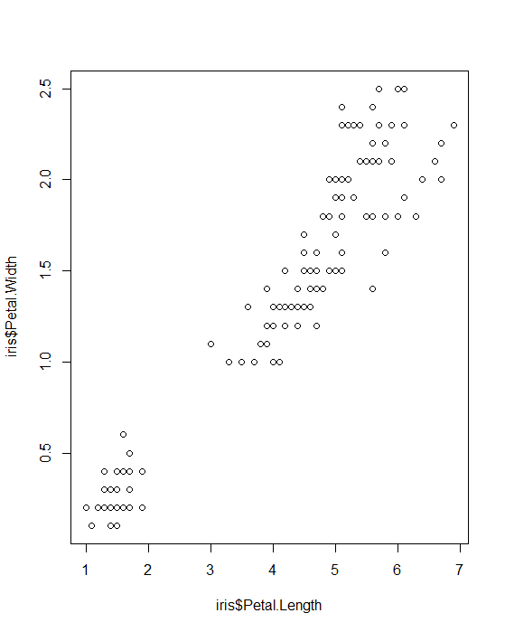

# Creating outputs

R is great for manipulating data and generating graphs, tables or reports. **BUT** it is usually not where these outputs are best viewed or used by the people for whom they are created. 
R allows you to export the objects you have generated into accessible formats, the most general ones being:

* Tables to `.csv` files
* Images/Graphs to `.JPEG` or `.PDF` files
* Reports (RMarkdowns) to `.html`, `.PDF` or word documents
* Reports to presentations (see packages to do this in markdown)
* Reports to books (RBookdowns)

This Chapter will focus on the basics: saving graphs and tables.The online resource are plentiful if you know what you're looking for. There are also chapters in [DfE's analytical academy](https://trello.com/b/QdDx3VmA/analytics-academy-an-r-training-course). Outputs such as shiny apps are beyond the scope of this resource, due to their complexity.


## Writing `.csvs`

This is the most common way to export tables that we have created or manipulated. Excel is more user-friendly than R for viewing data tables. 
Additionally, if you need to put a table into a MS word report, you might want to export it as a .csv as these are easier to copy or format (such as with colour, bolding or cell merging) prior to inserting the table into your word document.

Once again, writing a .csv is dependent on your working directory. You need to set this somewhere proximate to the folder you intend to write the .csv into
```{r eval=FALSE}
data("iris")

# we can write the iris data as a .csv in our outputs folder
write.csv(x = iris, file = "Outputs/iris_data.csv", row.names = FALSE)
```
This creates a `.csv` file in the Outputs folder called "iris_data".

By specifying that `row.names = FALSE`, the `.csv` will not have numbers 1:150 in the first column of the output file.

### writing multiple outputs as sheets of an excel file

[This video](https://www.youtube.com/watch?v=E0SLvyLYvoE) shows you how to do this


```{r eval = FALSE}
library(xlsx)
library(openxlsx)

# step 1: load relevant packages
# step 2: complete analysis as usual, giving each output a name (i.e. using R_Output_1_Name <- )
# step 3: use the following code to pull together 

Excel_File_Name <- list("Sheet_Name_1" = R_Output_1_Name, "Sheet_Name_2" = R_Output_2_Name)
write.xlsx(Excel_File_Name,"./Excel_File_Name.xlsx",overwrite = TRUE)

```

The packages y

## Saving graphs

After creating a graph, the best way to store the output is in a markdown or other feature of R that will update the rendered image if any of the inputs or code change. For ad hoc work, though, we might simply want to export an image. To do this we can either:

1. Create the plot, then click export (in the bottom right "viewer" panel) and save as either a PDF or JPEG 

```{r eval=FALSE}
Iris_Scatter <- plot(
  x = iris$Petal.Length,
  y = iris$Petal.Width
) 
```
```{r, echo=FALSE, out.width='80%', fig.align='center'}

```


2. Create a JPG/PDF with a line of code, then plant the plot into it 
```{r eval=FALSE}
#create the pdf
pdf("Outputs/iris_scatter.pdf", width = 8, height = 7, paper = "A4") 

#create the plot in the pdf
Iris_Scatter <- plot(
  x = iris$Petal.Length,
  y = iris$Petal.Width
) 

#close the pdf
dev.off()

# The JPEG arguments are very similar to those for a pdf
# jpeg(filename = "Outputs/iris_scatter.jpg", width = 500, height = 500)

```

You can also open plots and screenshot these if necessary.


## Markdowns, reports, books and presentations 

<span style="color:red;"> 
To populate at a later date if there is demand. 
</span>


