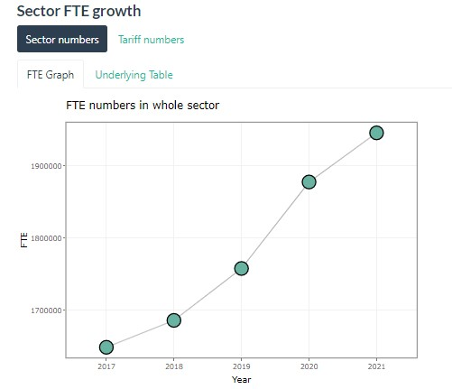

# Creating outputs

R is great for manipulating data and generating graphs, tables or reports. **BUT** R Studio is usually not where these outputs are best viewed or used by the people for whom they are created. 
R allows you to export the objects you have generated into accessible formats, the most general ones being:

* Tables to `.csv` files
* Images/Graphs to `.JPEG` or `.PDF` files
* Reports (RMarkdowns) to `.html`, `.PDF` or word documents
* Reports to presentations (see packages to do this in markdown)
* Reports to books (RBookdowns)
* Dashboards

This Chapter will focus on the basics: saving graphs and tables.The online resource are plentiful if you know what you're looking for. There are also chapters in [DfE's analytical academy](https://trello.com/b/QdDx3VmA/analytics-academy-an-r-training-course). Outputs such as shiny apps are beyond the scope of this resource.


## Writing `.csvs`

This is the most common way to export tables that we have created or manipulated. Excel is more user-friendly than R for viewing data tables. 
Additionally, if you need to put a table into a MS word report, you might want to export it as a .csv as these are easier to copy and format (such as with colour, bolding or cell merging) prior to inserting the table into your word document.

Once again, writing a .csv is dependent on your working directory. You need to set this somewhere proximate to the folder you intend to write the .csv into. Otherwise you could paste a whole file path URL int the `file =` argument
```{r eval=FALSE}
data("iris")

# we can write the iris data as a .csv in our outputs folder
write.csv(x = iris, file = "Outputs/iris_data.csv", row.names = FALSE)
```
This creates a `.csv` file in the Outputs folder called "iris_data".

By specifying that `row.names = FALSE`, the `.csv` will not have numbers 1:150 in the first column of the output file.

### Writing multiple outputs as sheets of an excel file

[This video](https://www.youtube.com/watch?v=E0SLvyLYvoE) shows you how to do this


```{r eval = FALSE}
library(xlsx)
library(openxlsx)

# step 1: load relevant packages
# step 2: complete analysis as usual, giving each output a name (i.e. using R_Output_1_Name <- )
# step 3: use the following code to pull together 

Excel_File_Name <- list("Sheet_Name_1" = R_Output_1_Name, "Sheet_Name_2" = R_Output_2_Name)
write.xlsx(Excel_File_Name,"./Excel_File_Name.xlsx",overwrite = TRUE)

```

## Saving objects

A good tip for reducing markdown (or other output) running speeds is to save your rendered objects and then read them into the markdown when you knit it, rather than sourcing all of the code. Graphs can be saved as .RDS objects so that when you read them in, they retain all of their underlying features, e.g., text labels, so that you can render them as interactive charts. Similarly, regression outputs can be saved with all the underlying data, so you can work with and manipulate them (e.g., extract particular values or present in a custom way). You use `readRDS()` to read the object back in. 

```{r eval = FALSE}
# example of saving an object
saveRDS(Object_Name, "Object_Name.Rds", version = 2)
```

## Saving graphs

After creating a graph, the best way to store the output is in a markdown or other feature of R that will update the rendered image if any of the inputs or code change. For ad hoc work, though, we might simply want to export an image. To do this we can either:

1. Create the plot, then click export (in the bottom right "viewer" panel) and save as either a PDF or JPEG 

```{r eval=FALSE}
Iris_Scatter <- plot(
  x = iris$Petal.Length,
  y = iris$Petal.Width
) 
```
```{r, echo=FALSE, out.width='80%', fig.align='center'}
knitr::include_graphics('images and graphics/iris.JPEG')
```


2. Create a JPG/PDF with a line of code, then plant the plot into it 
```{r eval=FALSE}
#create the pdf
pdf("Outputs/iris_scatter.pdf", width = 8, height = 7, paper = "A4") 

#create the plot in the pdf
Iris_Scatter <- plot(
  x = iris$Petal.Length,
  y = iris$Petal.Width
) 

#close the pdf
dev.off()

# The JPEG arguments are very similar to those for a pdf
# jpeg(filename = "Outputs/iris_scatter.jpg", width = 500, height = 500)

```

You can also open plots and screenshot these if necessary.


## R Markdown

This is [the bible for markdown](https://matt-dray.github.io/knitting-club/). [This link](https://ourcodingclub.github.io/tutorials/rmarkdown/) is good for basics.

I have started trying to store all outputs from a project in an outputs summary markdown (.rmd) so that other analysts can see exactly what is created, and what the objects used to do this are. 

A common format is shown below. You can also browse [this theme gallery](https://www.datadreaming.org/post/r-markdown-theme-gallery/) or google R markdown themes to see various default option styles. These would sit in place of the `flatly` argument below.

A more generic gallery of output formats that can be rendered through markdown are in the [R markdown gallery](https://rmarkdown.rstudio.com/gallery.html)

```{r eval=FALSE}
---
title: "Outputs for Recruitment limits IA and EQA"
author: "Tom Harris"
date: "`r Sys.Date()`"
output: 
  html_document:
    theme: flatly
    toc: true
    toc_float: true
    
---

<style type="text/css">
 body{ /* Normal  */
       font-size: 14px;
       font-family: "Segoe UI";
       font-size: 1.75em;
   }
 h1 { /* Header 1 */
   font-size: 31px;
 }
 h2 { /* Header 2 */
     font-size: 25px;
 }
 h3 { /* Header 3 */
   font-size: 21px;
 }
 code.r{ /* Code block */
     font-size: 12px;
 }
 pre { /* Code block - determines code spacing between lines */
     font-size: 14px;
 }
 </style>

<style>
div.border {border-style: solid; border-color:#D6DCE5;background-color: white; text-align: center; border-radius: 5px; padding: 10px;}
</style>

<style>
div.blue {background-color:#D6DCE5; border-radius: 5px; padding: 12px;}
</style>

```

Most markdown features are very intuitive. They can be googled very easily. For tabs, use `{.tabset}` and `{.tabset .tabset-pills}` with headings to define levels. You could just get rid of the ## Heading 1 line and have a single tier of tabs. See below example. The functions would need to be included as code chunks, rather than headings, but are shown together here for concision. 

```{r eval=FALSE}
## Sector FTE growth {.tabset .tabset-pills}
### Sector numbers {tabset}
#### FTE graph
ggplotly(sector_FTE_graph, tooltip = "text")
#### Underlying Table
kableExtra::kable(sector_growth,
                  format = "pipe")
### Tariff numbers{.tabset}
#### FTE graph 
ggplotly(tariff_FTE_graph, tooltip = "text")
#### Underlying Table
kableExtra::kable(tariff_growth,
                  format = "pipe")
```

```{r, echo=FALSE, out.width='80%', fig.align='center'}

```

## Presentations

You can use R markdown to create presentations. These allow interactivity. They can also enable your presentations to automatically update when the analysis does. 
There are some examples of presentations in the [R markdown gallery](https://rmarkdown.rstudio.com/gallery.html). `Xaringan` is also a useful and very flexible package. Writing presentations is quite complicated and there isn't much value in this book just having a few bits and bobs. Below are some good links to places with more detail.

* [Kate Jolly's blog](https://www.katiejolly.io/blog/2021-03-16/designing-slides)
* [Xaringanthemer documentation](https://cran.r-project.org/web/packages/xaringanthemer/xaringanthemer.pdf)
* [Xaringan themes github](https://github.com/yihui/xaringan/wiki/Themes)


## Other links

* [Unsplash.com](https://unsplash.com/) is great for downloading free, high resolution images.

